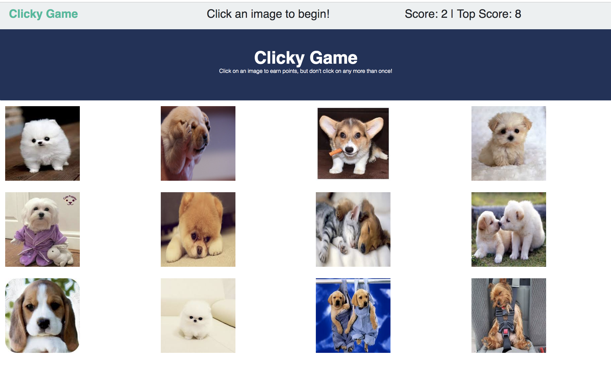

# Clicky

This application is Yet Another Game (YAG) which utilizes React to generate the user interface.

## Description 
This is a web-game which shows a grid of images and the user selects them in order to avoid selecting duplicates.  Once a duplicate selection is detected, the game is reset.

### Usage instructions

When the user is presented the webpage, they begin by clicking any image on the page.  The continue to select (click) the images and avoid duplicates.  As long as the user continues to select unique images, the score increase.  Once the user selects an image they've selected before, the loser loses and the games reset.

